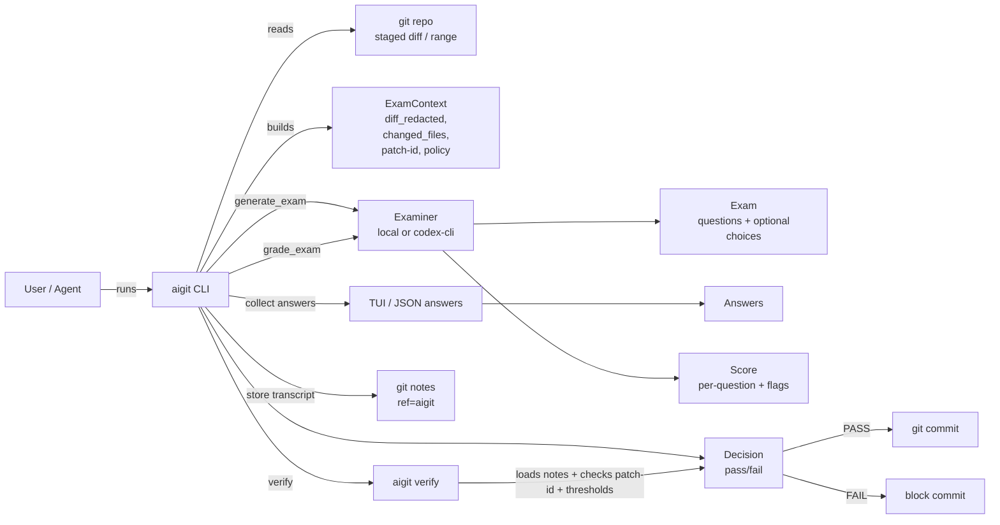
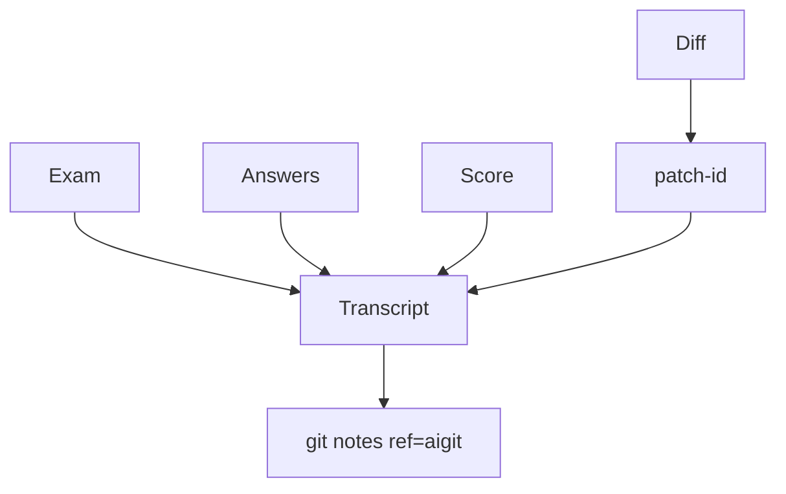
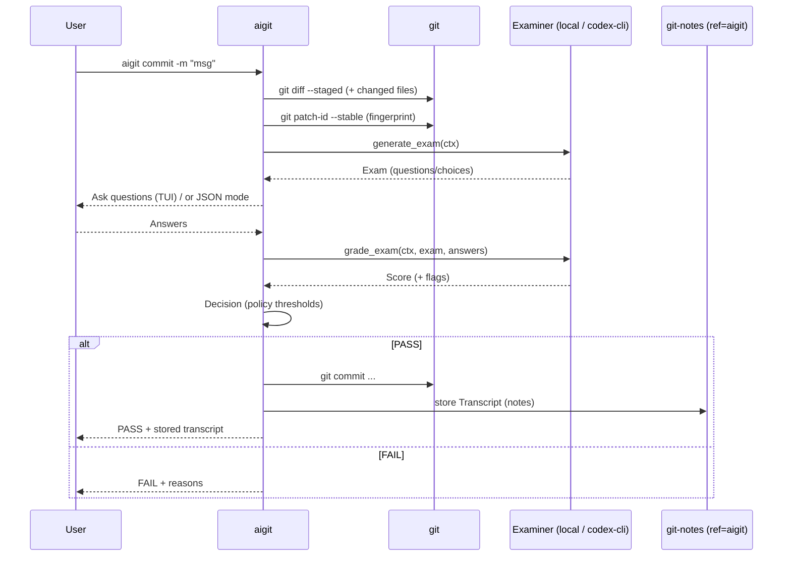

# aigit

`aigit` is a git-like CLI that blocks commits unless the committer can pass a deterministic “Proof-of-Understanding” (PoU) exam and an audit transcript is attached to the resulting commit.

Product requirements live in `docs/aigit.adoc`.

## Quickstart (day-to-day)

- Make a change (bugfix/refactor/etc.)
- Stage it: `git add -A`
- Commit via aigit: `aigit commit -m "your message"`
- Answer the prompts (end each answer with a line containing just `.`)
- (Optional) Verify later: `aigit verify HEAD`

## Architecture

### Key definitions

- **PoU (Proof-of-Understanding)**: a short exam that proves the committer understands what changed and why (risks, testing, rollback, etc.).
- **Exam**: a list of questions (some may be multiple-choice) generated for the current diff.
- **Answers**: the committer’s responses (TUI or JSON mode).
- **Score**: per-question scoring + flags used to decide pass/fail.
- **Transcript**: an auditable record containing the exam, answers, score, and decision.
- **Diff fingerprint**: a stable identifier for the diff (currently `git patch-id --stable`) to prevent “answer reuse” across different changes.
- **Provider**: how we generate/grade exams:
  - `local` = built-in static examiner (deterministic rubric)
  - `codex-cli` = Codex CLI generates a diff-aware exam and grades answers

### Components (high level)



### Data flow (what gets stored)



## Flows

### Flow: `aigit commit`



### Flow: `aigit exam`

- Builds context from **staged diff** (default) or `--range`.
- Generates an exam:
  - `local`: static questions
  - `codex-cli`: diff-aware questions (may include multiple-choice)
- Either prints the exam as JSON (`--format json` without `--answers`) or runs the TUI.

### Flow: `aigit verify <commit>`

- Loads the transcript from `git notes --ref=aigit` for the commit.
- Recomputes the commit’s diff fingerprint and compares it to the transcript.
- Re-checks policy thresholds (min score, required categories, max flags).
- Prints PASS/FAIL.

## MVP commands

- `aigit exam` (default: staged diff; `--format tui|json`)
- `aigit commit` (runs exam, then delegates to `git commit` on pass, and stores transcript in git notes)
- `aigit verify <commit-ish>` (validates transcript presence + diff fingerprint + thresholds)
- `aigit policy validate` / `aigit config set <key> <value>` (minimal policy support via `.aigit.toml`)

## Install

### From GitHub Releases (recommended)

Download the binary from the repo’s GitHub Releases page and put it on your `PATH` (e.g. `~/.local/bin`).

Or use the installer script (edit `AIGIT_REPO` if your repo slug differs):

```sh
curl -fsSL https://raw.githubusercontent.com/omarmahamid/aigit/main/scripts/install.sh | sh
```

### From source (Rust)

```sh
cargo install --path .
```

## Using Codex CLI as the grader

- Install Codex CLI (`codex`) and login (so `codex exec "hello"` works).
- In your repo, create `.aigit.toml`:

```toml
provider = "codex-cli"

[codex_cli]
command = "codex" # or: "npx -y @openai/codex@0.75.0"
sandbox = "read-only"
timeout_secs = 120
```

- Use it normally:
  - `git add -A`
  - `aigit commit -m "message"`

When enabled, Codex CLI will:
- Generate a diff-aware exam (questions tailored to the actual changes; may include multiple-choice questions).
- Grade your answers and include feedback in the transcript notes.

## Hook (optional)

Install a `pre-commit` hook that blocks `git commit` unless it was invoked through `aigit commit`:

```sh
aigit install-hook --mode pre-commit
```
